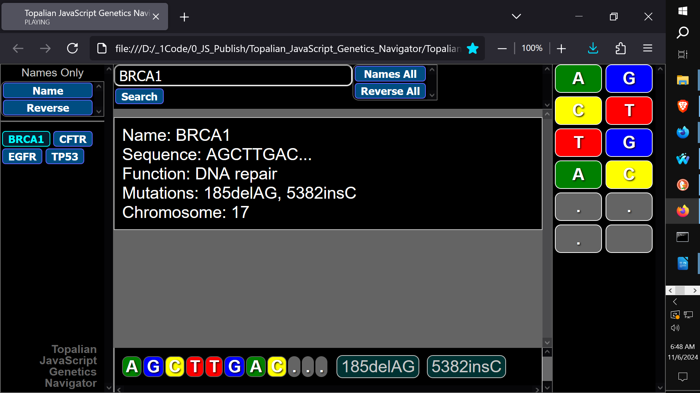
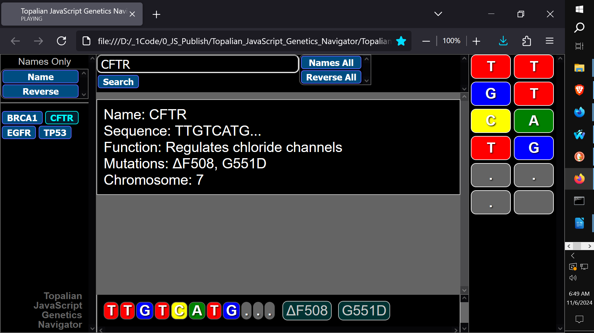
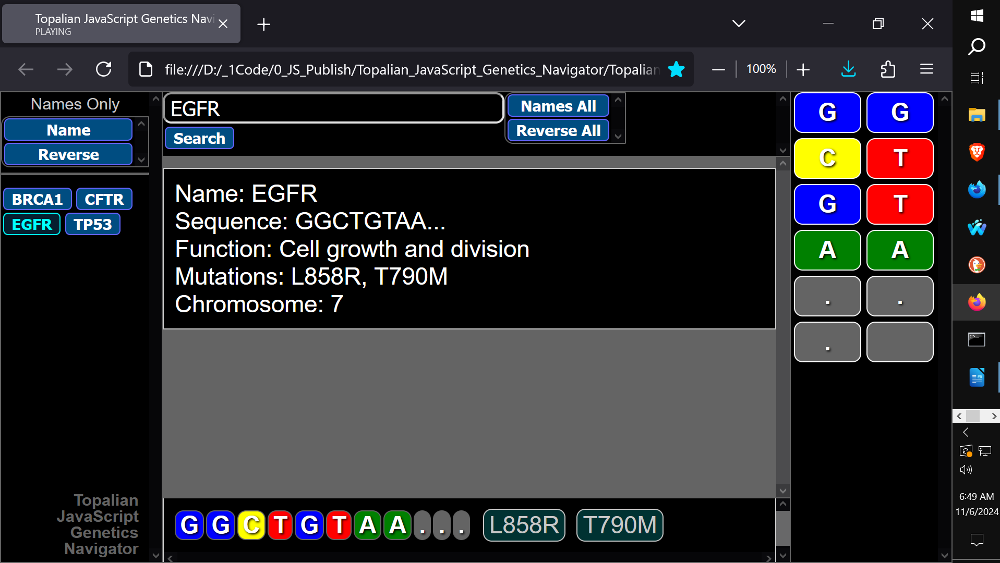
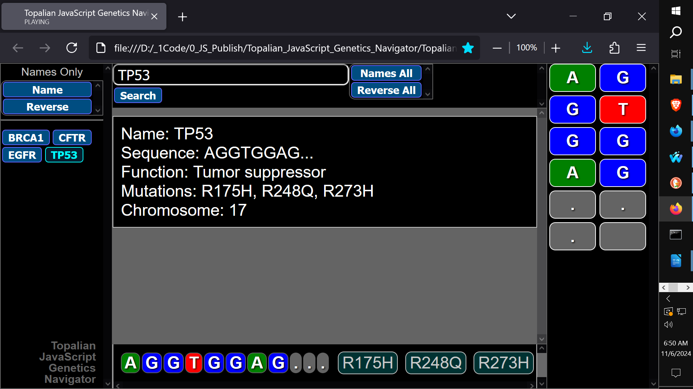
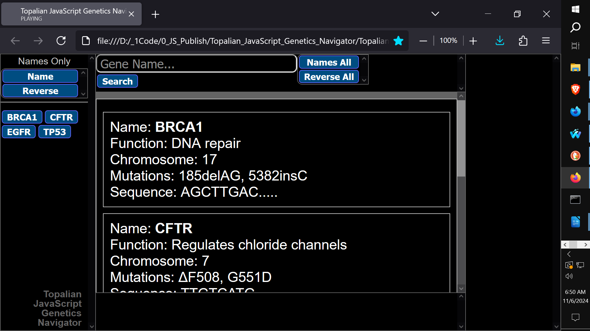
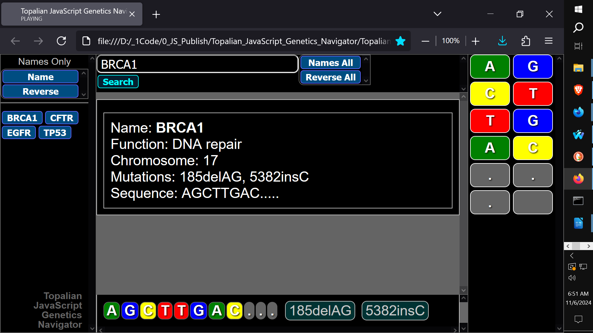
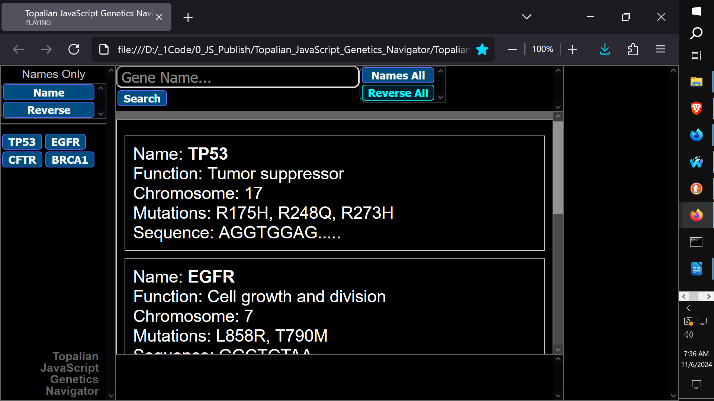

# CATopalian_JavaScript_Genetics_Navigator
A JavaScript application that shows a Visual Genetics Database that is easy for students to learn from. The genes are shown with multiple diagram styles.

USE APP: https://christopherandrewtopalian.github.io/CATopalian_JavaScript_Genetics_Navigator/CATopalian_JavaScript_Genetics_Navigator.html

Video: https://www.youtube.com/watch?v=MwZH8slqW8Q

---

### How to Download this App
1. Click the green Code Button on this github page
2. Choose Download ZIP
3. Save the Zip File
4. Extract All
5. Double click the HTML file to start the App

---

Hapy Scripting :-)